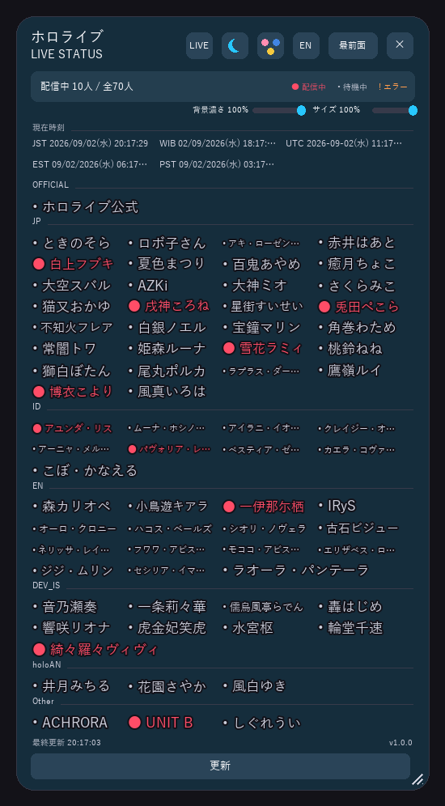
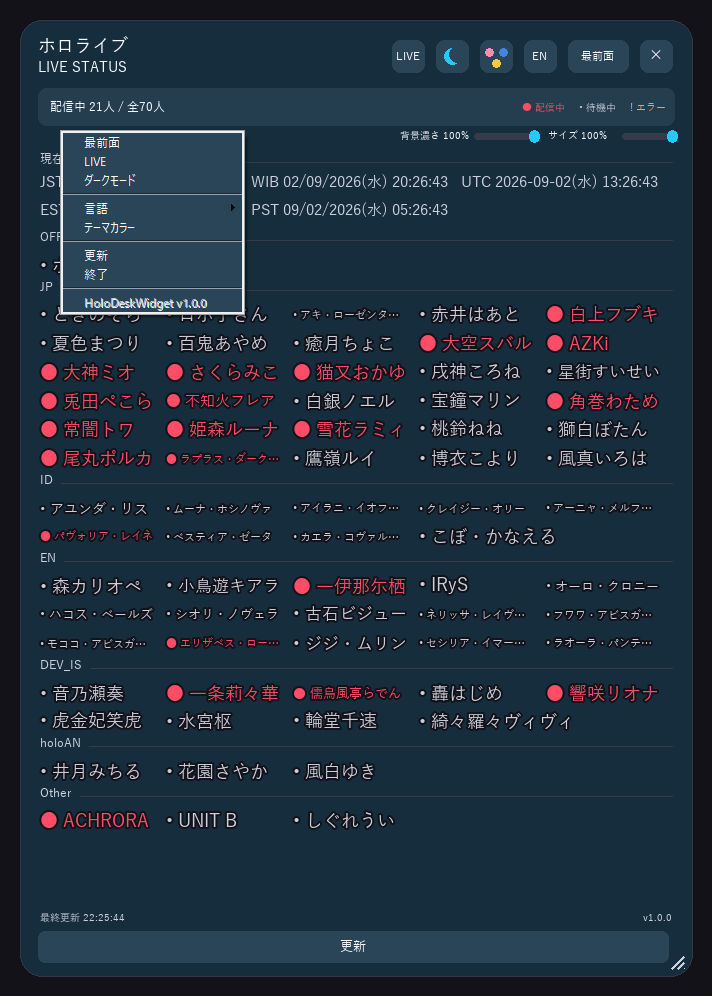
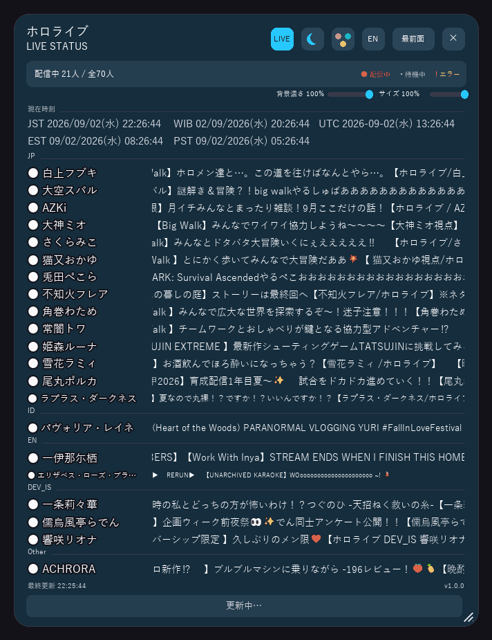

# HoloDeskWidget

[English](README.en.md) | 日本語

hololive所属タレントの配信状況を常時表示するWindowsデスクトップウィジェット。

> **注意**: 本プロジェクトは個人が制作した非公式のファンメイドツールです。hololive、hololive production、カバー株式会社とは一切関係がなく、公式の許諾を受けたものでもありません。

## 機能

- **配信状況の一覧表示**: 登録タレントの状態(配信中/待機中/取得エラー)を色分けカードで表示。カードのタレント名部分・配信タイトル部分はそれぞれクリックでクリップボードにコピーできます。
- **常時前面表示できる半透明ウィジェット**: デスクトップに常駐する透過ウィンドウ。背景部分のドラッグで移動、端・角のドラッグでサイズ変更ができます。
- **LIVEフィルタ**: 配信中のタレントだけに絞り込んで表示し、配信タイトルをティッカー(横スクロール)表示します。
- **世界時計**: JST/WIB/UTC/EST/PSTの現在時刻をあわせて表示します。
- **表示のカスタマイズ**: 最前面固定・ダークモード/ライトモード切替・テーマカラー(配色パレット)選択・表示言語(日本語/英語)切替を右上のボタンまたは右クリックメニューから操作できます。背景の透過度と文字サイズはスライダーで調整できます。
- **設定の自動保存**: ウィンドウ位置・サイズ・言語・テーマなどの個人設定は`settings.json`に自動保存され、次回起動時に復元されます。
- **チャンネル自動解決**: 起動時にhololive公式サイトのタレントページからYouTubeチャンネルを自動解決し、失敗した場合のみ`talents.json`の`channel_url`にフォールバックします。

## スクリーンショット

<p align="center">
  
  
</p>

左: タレントごとに配信状況を色分け表示するメイン画面。右: 右クリックメニューから最前面固定・LIVEフィルタ・ダークモード・言語・テーマカラー切り替えなどを操作できます(右上のボタン列からも同じ操作が可能です)。

<p align="center">
  
</p>

LIVEフィルタ使用時は、配信中のタレントに絞り込んだ上で配信タイトルがティッカー表示されます。

<p align="center">
  
</p>

## 動作環境

- **OS**: Windows専用(Win32レイヤードウィンドウ・`ctypes`/`windll`・Win32ミューテックスに依存しており、Windows以外では動作しません)。Windows 10 / 11での動作を想定しています。
- **インターネット接続**: 必須(hololive公式サイトからのチャンネル自動解決、YouTube innertube APIからの配信状況取得に使用します)。
- **配布版(exe)を使う場合**: 追加の準備は不要です。PyInstallerでビルドされた単体exeとして動作します。
- **開発環境から起動する場合**: Python 3.10以降と`requirements.txt`記載の依存パッケージ(`Pillow>=10.1,<12`)に加え、標準ライブラリの`tkinter`(Tcl/Tk)が必要です(python.org配布のインストーラには同梱されています)。
- **フォント**: 日本語表示にはYu Gothic(なければMeiryo→MS Gothicの順にフォールバック)、絵文字表示にはSegoe UI Emojiを使用します。いずれもWindows標準搭載フォントですが、East Asian言語サポートを追加していない環境などで欠けている場合はフォントが正しく描画されないことがあります。

## 構成

- `start_widget_native.py` — 起動エントリポイント(多重起動チェック→`holowidget`のウィジェットをmainloop実行)
- `holowidget/` — 本体パッケージ(常駐・透過表示・ドラッグ移動対応のWin32レイヤードウィンドウ実装)
  - `widget.py` — ウィンドウ本体(描画・イベント処理)
  - `config.py` — ウィンドウ既定値・`settings.json`の読み書き
  - `talents.py` — `talents.json`の読み込み
  - `youtube.py` — チャンネル解決・配信状況スクレイピング
  - `theme.py` / `strings.py` / `fonts.py` — 配色・多言語文字列・フォント
  - `layout.py` — 右上ボタン列の配置テーブル
  - `paths.py` — パス解決とログ出力(サイズ上限付きローテーション)
  - `single_instance.py` — 多重起動防止(Win32ミューテックス)
  - `version.py` — バージョン番号(右クリックメニューに表示)
- `talents.json` — 表示対象タレントの一覧（名前・ユニット・スラッグ・既知のチャンネルURL）
- `start_widget.bat` — ネイティブ版の起動ランチャー
- `build_widget.bat` — PyInstallerで`dist/HoloDesk Widget.exe`をビルド
- `find_python.bat` — `start_widget.bat`/`build_widget.bat`共通のPython検出スクリプト
- `release_widget.bat` — ビルド＋配布用zip(`release/HoloDeskWidget-v<version>.zip`)の作成
- `docs/Readme.html` / `docs/Readme.en.html` — エンドユーザー向け使い方ガイド(リリースzipに同梱)
- `docs/screenshots/` — 上記ガイドに埋め込むスクリーンショット・GIF
- `tools/capture_screenshots.py` / `capture_screenshots.bat` — `docs/screenshots/`内の画像・GIFを実際のウィジェットを操作して再撮影する開発者向けツール

## セットアップ

Python 3.10+ と以下の依存パッケージが必要です。

```bash
pip install -r requirements.txt
```

## 起動

### 開発環境から起動

```bash
start_widget.bat
```

`start_widget.bat` はPythonインストール先の自動検出、`pythonw.exe`の存在確認、Pillowの導入チェックを行った上でウィジェットを起動します。エラー発生時は `start_widget.log` を確認してください。

### 配布版(リリースzip)から起動

`release/HoloDeskWidget-v<version>.zip` を展開し、`HoloDesk Widget.exe` をダブルクリックするだけで起動します。Pythonのインストールなど事前準備は不要です。初回起動時にWindows SmartScreenの警告が出る場合は「詳細情報」→「実行」を選んでください(署名されていない実行ファイルのための一般的な警告です)。

## バージョン

現在のバージョン: **1.0.0**

`holowidget/version.py` の `__version__` が唯一の管理箇所です(ウィジェットの右クリックメニューにも表示されます)。リリース時はこの値を手動で更新してください。`release_widget.bat` はこの値を読み取り、`build_widget.bat`(PyInstaller)でexeをビルドした上で、exe・`talents.json`・`docs/Readme*.html` をまとめた `release/HoloDeskWidget-v<version>.zip` を作成します。

## リリース手順

1. バージョンを上げる場合は `holowidget/version.py` の `__version__` を更新し、`README.md` の `現在のバージョン: **x.y.z**`、`README.en.md` の `Current version: **x.y.z**`、`docs/Readme.html` / `docs/Readme.en.html` に埋め込まれた同じバージョン文字列も合わせて更新します。5箇所まとめて更新するには以下を使用します。
   ```bash
   python .claude/skills/release/scripts/bump_version.py <old_version> <new_version>
   ```
2. `release_widget.bat` を実行します。内部で `build_widget.bat`(PyInstaller、要インストール)を呼び出して `dist/HoloDesk Widget.exe` をビルドし、exe・`talents.json`・`docs/Readme.html`・`docs/Readme.en.html` の4点を `release/HoloDeskWidget-v<version>.zip` にまとめます(`settings.json`やログなどの実行時生成ファイルは含まれません)。
3. 生成された `release/HoloDeskWidget-v<version>.zip` を配布します。`build/`・`dist/`・`release/` はgit管理対象外です。

## タレント一覧の更新

`talents.json` に `{"name": "...", "unit": "...", "slug": "...", "channel_url": "..."}` の形式でエントリを追加/編集します。起動時は常にhololive公式サイトのタレントページからチャンネルの自動解決を試み、失敗したときだけ`channel_url`(未指定なら`https://www.youtube.com/@<slug>`)にフォールバックします。自動解決が失敗しやすいタレント(卒業済みなど)では`channel_url`を指定しておくと安定します。

## 注意

配信中判定はYouTubeの内部API(innertube)経由でチャンネルの「Live」タブを取得して行っており、非公式な方法です。YouTube側の仕様変更で動作しなくなる可能性があります。

## ライセンス

[MIT License](LICENSE)。ただし本ライセンスはソースコードにのみ適用され、「hololive」「hololive production」および各タレント名などの第三者の商標・名称の権利を許諾するものではありません。
