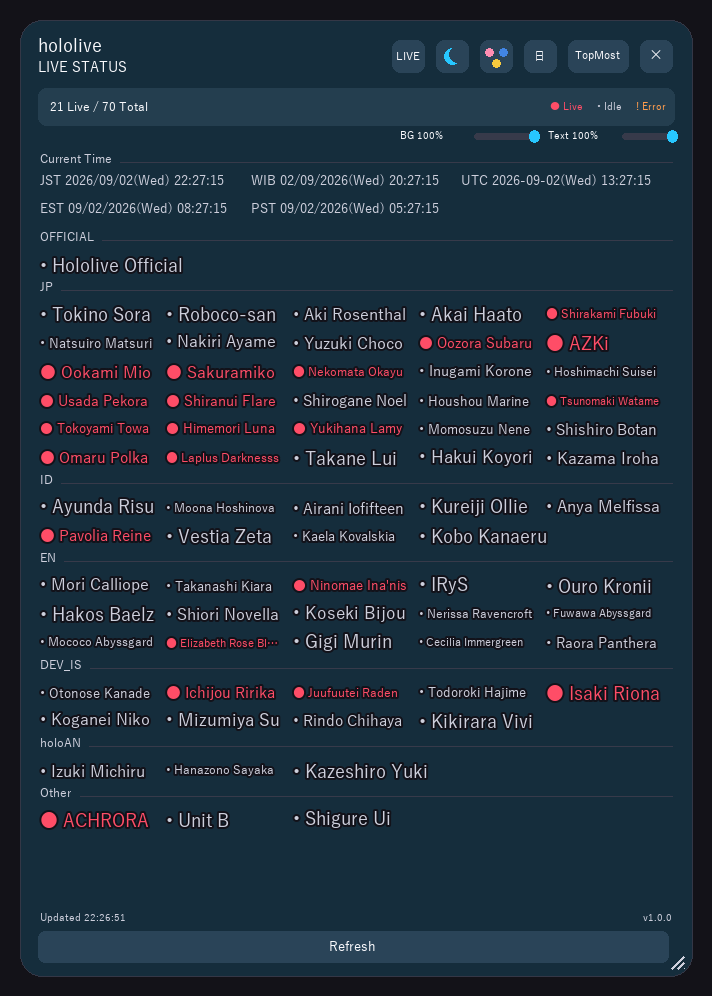
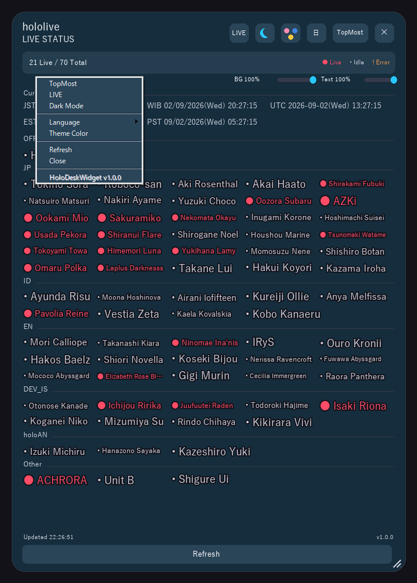
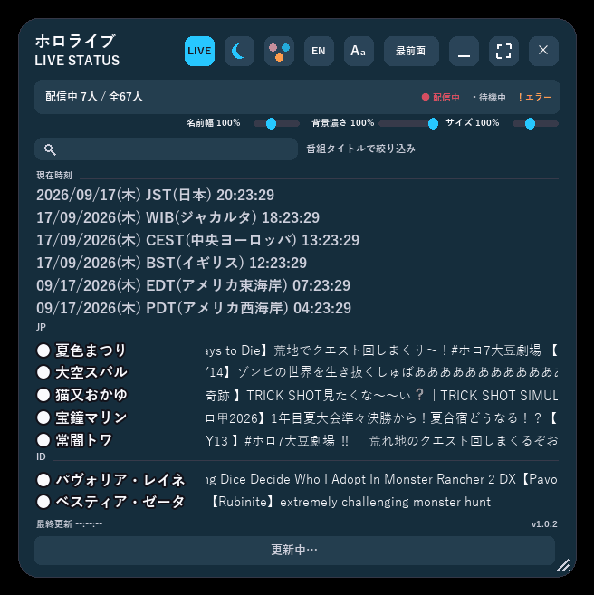

# HoloDeskWidget

English | [日本語](README.md)

A Windows desktop widget that keeps the live-stream status of hololive talents visible at all times.

> **Disclaimer**: This is an unofficial, fan-made project created by an individual. It is not affiliated with, endorsed by, or associated with hololive, hololive production, or COVER Corp. in any way.

## Features

- **Live-status overview**: Shows each registered talent's status (live / idle / fetch error) as color-coded cards. Clicking a card copies the talent's name, and clicking the stream title copies the title, to the clipboard.
- **Always-on-top, semi-transparent desktop widget**: A persistent, transparent window you can drag by its background to move, and drag by its edges/corners to resize.
- **LIVE filter**: Narrows the list down to only the talents currently live, and shows their stream titles as a scrolling ticker.
- **World clock**: Displays the current time in JST/WIB/UTC/EST/PST alongside the talent list.
- **Display customization**: Toggle always-on-top, dark/light mode, theme color (palette), and display language (Japanese/English) from the top-right buttons or the right-click menu. Background opacity and text size are adjustable via sliders.
- **Settings persistence**: Window position/size, language, theme, and other personal settings are saved automatically to `settings.json` and restored on the next launch.
- **Automatic channel resolution**: On startup, resolves each talent's YouTube channel from the hololive official site's talent page, falling back to `channel_url` in `productions/hololive.json` only if that resolution fails.

## Screenshots

<p align="center">
  
  
</p>

Left: the main view, showing each talent's live status as color-coded cards. Right: the right-click menu, which offers the same always-on-top / LIVE filter / dark mode / language / theme color toggles as the top-right button row.

<p align="center">
  
</p>

With the LIVE filter enabled, the list narrows to talents currently live and their stream titles scroll by as a ticker.

<p align="center">
  
</p>

## System requirements

- **OS**: Windows only (relies on Win32 layered windows, `ctypes`/`windll`, and a Win32 mutex — it will not run on other platforms). Targeted at Windows 10 / 11.
- **Internet connection**: Required (used for channel auto-resolution from the hololive official site and for fetching live status via YouTube's innertube API).
- **Using the release exe**: No extra setup needed — it's a self-contained executable built with PyInstaller.
- **Running from the development environment**: Requires Python 3.10+, the dependencies in `requirements.txt` (`Pillow>=10.1,<12`), and the standard-library `tkinter` (Tcl/Tk), which is bundled with the python.org installer.
- **Fonts**: Japanese text uses Yu Gothic (falling back to Meiryo, then MS Gothic), and emoji use Segoe UI Emoji. These ship with Windows by default, but may be missing on installs without East Asian language support added, in which case text may not render correctly.

## Structure

This repository builds two apps -- HoloDeskWidget and its multi-production sibling VTDeskWidget -- as two exes from one shared engine package. Everything specific to HoloDeskWidget lives under `variants/holo/` (VTDeskWidget's own files are under `variants/vt/`).

- `start_widget_holo.py` — HoloDeskWidget's launch entry point (checks for duplicate instances → runs the `deskwidget_core` widget's mainloop)
- `deskwidget_core/` — the engine package shared by both apps (Win32 layered-window implementation supporting always-on-top, transparency, and drag-to-move)
  - `widget.py` — the window itself (drawing and event handling)
  - `config.py` — window defaults and `settings.json` read/write
  - `talents.py` — loads `productions/index.json` and each production's talent-list JSON
  - `youtube.py` — channel resolution and live-status detection (via YouTube's internal innertube API)
  - `theme.py` / `strings.py` / `fonts.py` — colors, localized strings, and fonts
  - `layout.py` / `grid_layout.py` — button row, tab strip, and talent-grid layout math
  - `paths.py` — path resolution and logging (size-capped rotation)
  - `single_instance.py` — prevents duplicate instances (Win32 mutex)
  - `appconfig.py` — holder for the per-variant values (app name, accent color, version, ...) each variant supplies
- `variants/holo/` — everything specific to HoloDeskWidget
  - `profile.py` — app name, accent color, version, etc. handed to `appconfig`
  - `version.py` — version number (shown in the right-click menu)
  - `productions/index.json` / `productions/hololive.json` — the talent list to display (a single hololive production)
  - `docs/Readme.html` / `docs/Readme.en.html` — end-user usage guides (bundled into the release zip)
  - `docs/screenshots/` — screenshots/GIF embedded in the guides above
- `start_widget_holo.bat` — launcher for the native (Holo) version
- `build_widget.bat holo|vt` — builds the given variant's exe with PyInstaller
- `find_python.bat` — shared Python-detection script used by `start_widget_holo.bat`/`build_widget.bat`
- `release_widget.bat holo|vt` — builds and packages the distributable zip (`release/<AppName>-v<version>.zip`)
- `tools/capture_screenshots.py` / `capture_screenshots.bat` — developer tool that drives the running widget to re-capture the images/GIF in `variants/holo/docs/screenshots/`

## Setup

Requires Python 3.10+ and the following dependencies.

```bash
pip install -r requirements.txt
```

## Launching

### From the development environment

```bash
start_widget_holo.bat
```

`start_widget_holo.bat` auto-detects the Python installation, checks that `pythonw.exe` exists, verifies Pillow is installed, and then launches the widget. If an error occurs, check `variants/holo/start_widget.log`.

### From the distributed release zip

Extract `release/HoloDeskWidget-v<version>.zip` and double-click `HoloDesk Widget.exe` to launch it. No Python installation or other setup is required. If Windows SmartScreen shows a warning on first launch, choose "More info" → "Run anyway" (this is expected for an unsigned executable).

## Version

Current version: **1.0.2**

`__version__` in `variants/holo/version.py` is the single source of truth (it is also shown in the widget's right-click menu). Update this value manually when releasing. `release_widget.bat holo` reads this value, builds the exe via `build_widget.bat holo` (PyInstaller), and packages the exe, `productions/`, and `docs/Readme*.html` into `release/HoloDeskWidget-v<version>.zip`.

## Release process

1. To bump the version, update `__version__` in `variants/holo/version.py`, along with the matching `Current version: **x.y.z**` string in `variants/holo/README.en.md`, the `現在のバージョン: **x.y.z**` string in `variants/holo/README.md`, and the version strings embedded in `variants/holo/docs/Readme.html` / `docs/Readme.en.html`. To update all five locations at once, use:
   ```bash
   python .claude/skills/release/scripts/bump_version.py holo <old_version> <new_version>
   ```
2. Run `release_widget.bat holo`. It calls `build_widget.bat holo` (PyInstaller, must be installed) to build `dist/HoloDesk Widget.exe`, then packages the exe, `productions/`, `docs/Readme.html`, and `docs/Readme.en.html` into `release/HoloDeskWidget-v<version>.zip` (runtime-generated files like `settings.json` and logs are excluded). VTDeskWidget follows the same steps with `vt` in place of `holo` (see `.claude/skills/release/SKILL.md`).
3. Distribute the resulting `release/HoloDeskWidget-v<version>.zip`. `build/`, `dist/`, and `release/` are all gitignored.

## Updating the talent list

Add or edit entries in `variants/holo/productions/hololive.json` using the format `{"name": "...", "unit": "...", "slug": "...", "channel_url": "..."}`. At startup the widget always tries to resolve the channel from the hololive official site's talent page first, and falls back to `channel_url` (or `https://www.youtube.com/@<slug>` if omitted) only when that resolution fails. Setting `channel_url` explicitly helps for talents where auto-resolution tends to fail (e.g. graduated talents whose hololivepro page no longer links a channel).

## Notes

Live status is determined via YouTube's internal API (innertube), which fetches the channel's "Live" tab — an unofficial method. It may stop working if YouTube changes this API.

## License

[MIT License](../../LICENSE). This license covers the source code only; it does not grant any rights to third-party trademarks or names such as "hololive", "hololive production", or individual talent names.
