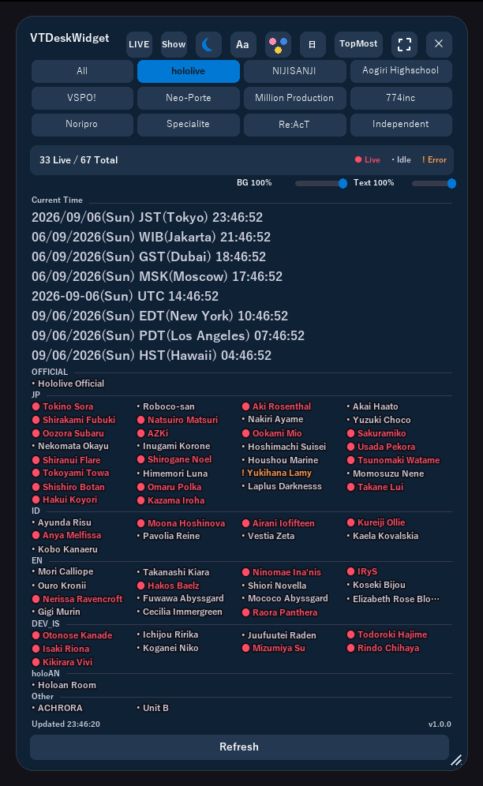
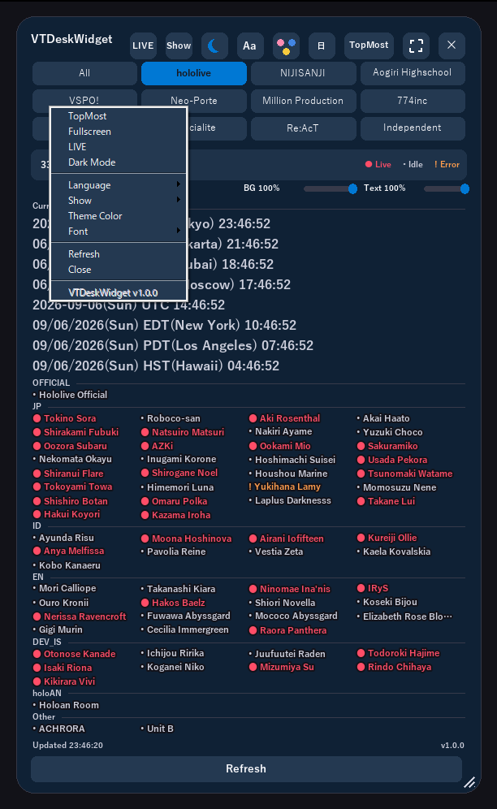
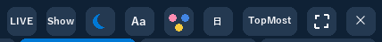
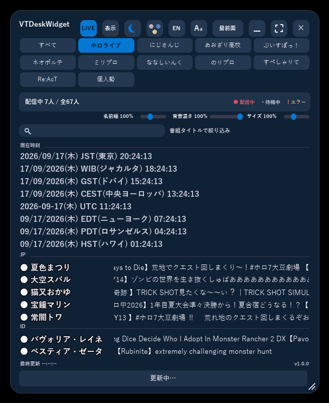

# VTDeskWidget

English | [日本語](README.md)

A Windows desktop widget that keeps the live-stream status of VTuber talents visible at all times, across multiple agencies/production tabs<br>
(hololive, NIJISANJI, Aogiri Highschool, VSPO!, Neo-Porte, Million Production, 774inc, Noripro, Specialite, Re:AcT, and more).

> **Disclaimer**: This is an unofficial, fan-made project created by an individual.<br>
> It is not affiliated with, endorsed by, or associated with hololive/hololive production/COVER Corp., NIJISANJI/ANYCOLOR, Aogiri Highschool, VSPO!/Gemdisc, Neo-Porte, or any other talent/agency referenced in this app, in any way.

## Features

- **Multiple productions, switchable by tab**: hololive, NIJISANJI, Aogiri Highschool, VSPO!, Neo-Porte, Million Production, 774inc, Noripro, Specialite, Re:AcT, and a user-editable "Independent" tab for your own custom talent list.<br>
  Each tab is backed by its own JSON file under `productions/`, so adding another production later needs no code changes.<br>
  An "All" tab is always shown first, aggregating every visible production's talents into one list.
- **Live-status overview**: Shows each registered talent's status (live / idle / fetch error) as color-coded cards.<br>
  Clicking a card opens that talent's live stream in your browser (or their channel page if they're not live).<br>
  Right-clicking a card brings up a menu to copy the talent's name or stream title to the clipboard.
- **Always-on-top, semi-transparent desktop widget**: A persistent, transparent window you can drag by its background to move, and drag by its edges/corners to resize.
- **LIVE filter**: Narrows the list down to only the talents currently live, and shows their stream titles as a scrolling ticker.
- **World clock**: Displays the region name and current time for a configurable list of zones (Hawaii/Los Angeles/New York/UTC/Moscow/Dubai/Jakarta/Tokyo by default) alongside the talent list.<br>
  Edit `clock_zones.json` to add, remove, or relabel zones (or rename their regions) without touching code.
- **Display customization**: Toggle always-on-top, dark/light mode, theme color (palette), font, display language (Japanese/English), and which production tabs are shown (checklist, with "Enable All" / "Disable All" shortcuts) from the top-right buttons or the right-click menu.<br>
  Background opacity and text size are adjustable via sliders.
- **Settings persistence**: Window position/size, language, theme, font, active/shown production tabs, and other personal settings are saved automatically to `settings.json` and restored on the next launch.
- **Automatic channel resolution (hololive tab only)**: On startup, resolves each hololive talent's YouTube channel from the hololive official site's talent page, falling back to that talent's `channel_url` only if resolution fails.<br>
  Other productions don't have a known official site to scrape, so they always use the `channel_url` given in their JSON file directly.

## Screenshots

<p align="center">
  
  
</p>

Left: the main view, showing each talent's live status as color-coded cards.<br>
Right: the right-click menu, which offers the same always-on-top / LIVE filter / dark mode / language / theme color toggles as the top-right button row.

<p align="center">
  
</p>

With the LIVE filter enabled, the list narrows to talents currently live and their stream titles scroll by as a ticker.

<p align="center">
  
</p>

## System requirements

- **OS**: Windows only (relies on Win32 layered windows, `ctypes`/`windll`, and a Win32 mutex — it will not run on other platforms).<br>
  Targeted at Windows 10 / 11.
- **Internet connection**: Required (used for channel auto-resolution from the hololive official site and for fetching live status via YouTube's innertube API).
- **Using the release exe**: No extra setup needed — it's a self-contained executable built with PyInstaller.
- **Running from the development environment**: Requires Python 3.10+, the dependencies in `requirements.txt` (`Pillow>=10.1,<12`),<br>
  and the standard-library `tkinter` (Tcl/Tk), which is bundled with the python.org installer.
- **Fonts**: Japanese text uses Yu Gothic (falling back to Meiryo, then MS Gothic), and emoji use Segoe UI Emoji.<br>
  These ship with Windows by default, but may be missing on installs without East Asian language support added, in which case text may not render correctly.

## Structure

This repository builds two apps -- VTDeskWidget and its single-production sibling HoloDeskWidget -- as two exes from one shared engine package. Everything specific to VTDeskWidget lives under `variants/vt/` (HoloDeskWidget's own files are under `variants/holo/`).

- `start_widget_vt.py` — VTDeskWidget's launch entry point (checks for duplicate instances → runs the `deskwidget_core` widget's mainloop)
- `deskwidget_core/` — the engine package shared by both apps (Win32 layered-window implementation supporting always-on-top, transparency, and drag-to-move)
  - `widget.py` — the window's state management; composes the mixins below into the widget
  - `rendering.py` — Pillow-based drawing (the `render()` pass and its drawing helpers)
  - `interaction.py` — mouse/keyboard event handling (drag-to-move, resize, click dispatch, slider dragging)
  - `menus.py` — the right-click context menu, theme-color palette, font picker, and production checklist popups
  - `refresh.py` — background refresh (per-talent worker threads, channel resolution, live-status fetching)
  - `grid_layout.py` — geometry/hit-testing that depends on live widget state (window size, selected production, text scale); the production tab strip itself doesn't appear at all for a variant with only one production (HoloDeskWidget)
  - `layout.py` — pure, state-free layout tables for the top-right button row and the production tab strip
  - `config.py` — window defaults and `settings.json` read/write
  - `talents.py` — loads `productions/index.json` (the production manifest) and each production's talent-list JSON
  - `youtube.py` — channel resolution and live-status detection (via YouTube's internal innertube API)
  - `theme.py` / `strings.py` / `fonts.py` — colors, localized strings, and fonts (`strings.py` also loads `clock_zones.json`)
  - `paths.py` — path resolution and logging (size-capped rotation)
  - `single_instance.py` — prevents duplicate instances (Win32 mutex)
  - `appconfig.py` — holder for the per-variant values (app name, accent color, version, ...) each variant supplies
- `variants/vt/` — everything specific to VTDeskWidget
  - `profile.py` — app name, accent color, version, etc. handed to `appconfig`
  - `version.py` — version number (shown in the right-click menu)
  - `productions/` — one JSON file per production tab, plus the manifest that lists them
    - `index.json` — manifest: tab order, id, display name (ja/en), talent-list filename, and whether hololive-style auto channel-resolution applies
    - `hololive.json` / `nijisanji.json` / `aogiri.json` / `vspo.json` / `neoporte.json` / `milpro.json` / `nanashi.json` / `noripro.json` / `specialite.json` / `react.json` — each production's talent list (name, unit, slug, known channel URL)
    - `custom.json` — the "Independent" tab's talent list; ships with a starter set of talents already in it, and you're free to add, edit, or remove entries
  - `clock_zones.json` — world-clock zone list (label, UTC offset, date field order, Japanese/English region name); hand-edit to add/remove/relabel zones or rename regions.<br>
    An optional `dst` field (e.g. `{"rule": "us"|"eu", "offset_hours": 1, "label": "EDT"}`) auto-switches the label and offset during that zone's summer-time period; zones without it stay fixed year-round
  - `docs/Readme.html` / `docs/Readme.en.html` — end-user usage guides (bundled into the release zip)
  - `docs/screenshots/` — screenshots/GIF embedded in the guides above
- `start_widget_vt.bat` — launcher for the native (VT) version
- `build_widget.bat holo|vt` — builds the given variant's exe with PyInstaller
- `find_python.bat` — shared Python-detection script used by `start_widget_vt.bat`/`build_widget.bat`
- `release_widget.bat holo|vt` — builds and packages the distributable zip (`release/<AppName>-v<version>.zip`)
- `tools/capture_screenshots.py` / `capture_screenshots.bat` — developer tool that drives the running widget to re-capture the images/GIF in `variants/holo/docs/screenshots/` (currently Holo-only)

## Setup

Requires Python 3.10+ and the following dependencies.

```bash
pip install -r requirements.txt
```

## Launching

### From the development environment

```bash
start_widget_vt.bat
```

`start_widget_vt.bat` auto-detects the Python installation, checks that `pythonw.exe` exists, verifies Pillow is installed, and then launches the widget.<br>
If an error occurs, check `variants/vt/start_widget.log`.

### From the distributed release zip

Extract `release/VTDeskWidget-v<version>.zip` and double-click `VTDeskWidget.exe` to launch it. No Python installation or other setup is required.<br>
If Windows SmartScreen shows a warning on first launch, choose "More info" → "Run anyway" (this is expected for an unsigned executable).

## Version

Current version: **1.0.0**

`__version__` in `variants/vt/version.py` is the single source of truth (it is also shown in the widget's right-click menu). Update this value manually when releasing.<br>
`release_widget.bat vt` reads this value, builds the exe via `build_widget.bat vt` (PyInstaller), and packages the exe, the `productions/` folder, `clock_zones.json`, and `docs/Readme*.html` into `release/VTDeskWidget-v<version>.zip`.

## Release process

1. To bump the version, update `__version__` in `variants/vt/version.py`, along with the matching `Current version: **x.y.z**` string in `variants/vt/README.en.md`, the `現在のバージョン: **x.y.z**` string in `variants/vt/README.md`, and the version strings embedded in `variants/vt/docs/Readme.html` / `docs/Readme.en.html`.<br>
   To update all five locations at once, use:
   ```bash
   python .claude/skills/release/scripts/bump_version.py vt <old_version> <new_version>
   ```
2. Run `release_widget.bat vt`. It calls `build_widget.bat vt` (PyInstaller, must be installed) to build `dist/VTDeskWidget.exe`,<br>
   then packages the exe, the `productions/` folder, `clock_zones.json`, `docs/Readme.html`, and `docs/Readme.en.html` into `release/VTDeskWidget-v<version>.zip` (runtime-generated files like `settings.json` and logs are excluded). HoloDeskWidget follows the same steps with `holo` in place of `vt` (see `.claude/skills/release/SKILL.md`).
3. Distribute the resulting `release/VTDeskWidget-v<version>.zip`.<br>
   `build/`, `dist/`, and `release/` are all gitignored.

## Updating the talent lists

Each production tab is a separate JSON file under `variants/vt/productions/`, listed in `productions/index.json` (id, display name, filename, and whether hololive-style auto-resolution applies).<br>
To edit an existing production's roster, add or edit entries in its file using the format `{"name": "...", "unit": "...", "slug": "...", "channel_url": "..."}`.<br>
Only the hololive tab (`auto_resolve: "hololivepro"` in the manifest) tries to resolve the channel from the hololive official site's talent page first, falling back to `channel_url` (or `https://www.youtube.com/@<slug>` if omitted) only when that fails;<br>
every other production always uses `channel_url` as given, so set it accurately.

To add your own talents without touching any other production's list, edit `productions/custom.json` — it shows up as the "Independent" (個人勢) tab.<br>
To add an entirely new production tab, create a new JSON file next to the others and add an entry for it to `productions/index.json`; no code changes are needed.

## Notes

Live status is determined via YouTube's internal API (innertube), which fetches the channel's "Live" tab — an unofficial method.<br>
It may stop working if YouTube changes this API.

## License

[MIT License](../../LICENSE).<br>
This license covers the source code only; it does not grant any rights to third-party trademarks or names such as "hololive"/"hololive production", "NIJISANJI", "Aogiri Highschool", "VSPO!", "Neo-Porte", or individual talent names.
