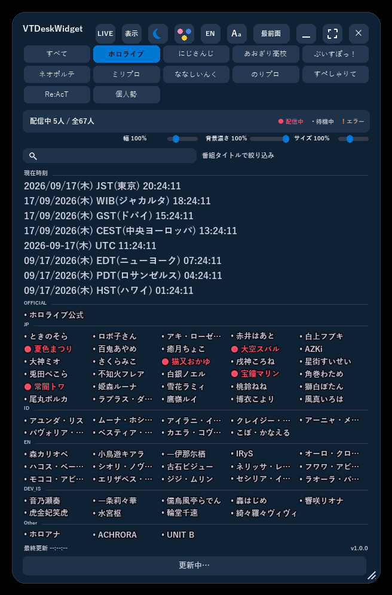
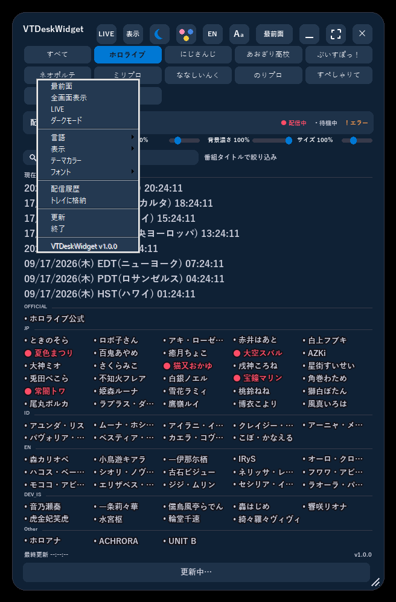
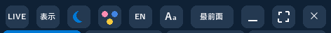

# VTDeskWidget

[English](README.en.md) | 日本語

hololive・にじさんじ・あおぎり高校・ぶいすぽっ！・ネオポルテ・ミリプロ・ななしいんく・のりプロ・すぺしゃりて・Re:AcTなど、<br>
複数プロダクションのVTuberタレントの配信状況をタブ切替で常時表示するWindowsデスクトップウィジェット。

> **注意**: 本プロジェクトは個人が制作した非公式のファンメイドツールです。<br>
> hololive/hololive production/カバー株式会社、にじさんじ/ANYCOLOR、あおぎり高校、ぶいすぽっ！/Gemdisc、ネオポルテ、その他本アプリが参照する各タレント・プロダクションとは一切関係がなく、公式の許諾を受けたものでもありません。

## 機能

- **複数プロダクションをタブで切替**: ホロライブ・にじさんじ・あおぎり高校・ぶいすぽっ！・ネオポルテ・ミリプロ・ななしいんく・のりプロ・すぺしゃりて・Re:AcTに加え、自分で編集できる「個人勢」タブを用意。<br>
  各タブは`productions/`配下の独自JSONファイルで構成されており、今後プロダクションを追加する際もコード変更は不要です。<br>
  表示中の全プロダクションのタレントをまとめて確認できる「すべて」タブも常に先頭に表示されます。
- **配信状況の一覧表示**: 登録タレントの状態(配信中/待機中/取得エラー)を色分けカードで表示。<br>
  カードをクリックすると、配信中ならその配信番組のページを、そうでなければチャンネルページをブラウザで開きます。<br>
  カードを右クリックすると、タレント名・配信タイトルをそれぞれクリップボードにコピーするメニューが出ます。
- **常時前面表示できる半透明ウィジェット**: デスクトップに常駐する透過ウィンドウ。<br>
  背景部分のドラッグで移動、端・角のドラッグでサイズ変更ができます。
- **LIVEフィルタ**: 配信中のタレントだけに絞り込んで表示し、配信タイトルをティッカー(横スクロール)表示します。
- **世界時計**: `clock_zones.json`で設定した時刻帯(初期値はハワイ/ロサンゼルス/ニューヨーク/UTC/中央ヨーロッパ/ドバイ/ジャカルタ/東京の8種類)の地域名・現在時刻をあわせて表示します。<br>
  ゾーンの追加・削除・ラベル変更・地域名変更はコードを触らずJSON編集だけで行えます。
- **表示のカスタマイズ**: 最前面固定・ダークモード/ライトモード切替・テーマカラー(配色パレット)選択・フォント選択・表示言語(日本語/英語)切替・表示するプロダクションタブの選択(チェックリスト、「全て有効」「全て無効」の一括切替つき)を右上のボタンまたは右クリックメニューから操作できます。<br>
  背景の透過度と文字サイズはスライダーで調整できます。
- **設定の自動保存**: ウィンドウ位置・サイズ・言語・テーマ・フォント・選択中/表示するプロダクションタブなどの個人設定は`settings.json`に自動保存され、次回起動時に復元されます。
- **チャンネル自動解決(ホロライブタブのみ)**: 起動時にhololive公式サイトのタレントページからYouTubeチャンネルを自動解決し、失敗した場合のみそのタレントの`channel_url`にフォールバックします。<br>
  他のプロダクションは自動解決に使える公式サイトが分かっていないため、常にJSON内の`channel_url`をそのまま使用します。

## スクリーンショット

<p align="center">
  
  
</p>

左: タレントごとに配信状況を色分け表示するメイン画面。<br>
右: 右クリックメニューから最前面固定・LIVEフィルタ・ダークモード・言語・テーマカラー切り替えなどを操作できます(右上のボタン列からも同じ操作が可能です)。

<p align="center">
  
</p>

LIVEフィルタ使用時は、配信中のタレントに絞り込んだ上で配信タイトルがティッカー表示されます。

<p align="center">
  
</p>

## 動作環境

- **OS**: Windows専用(Win32レイヤードウィンドウ・`ctypes`/`windll`・Win32ミューテックスに依存しており、Windows以外では動作しません)。<br>
  Windows 10 / 11での動作を想定しています。
- **インターネット接続**: 必須(hololive公式サイトからのチャンネル自動解決、YouTube innertube APIからの配信状況取得に使用します)。
- **配布版(exe)を使う場合**: 追加の準備は不要です。<br>
  PyInstallerでビルドされた単体exeとして動作します。
- **開発環境から起動する場合**: Python 3.10以降と`requirements.txt`記載の依存パッケージ(`Pillow>=10.1,<12`)に加え、<br>
  標準ライブラリの`tkinter`(Tcl/Tk)が必要です(python.org配布のインストーラには同梱されています)。
- **フォント**: 日本語表示にはYu Gothic(なければMeiryo→MS Gothicの順にフォールバック)、絵文字表示にはSegoe UI Emojiを使用します。<br>
  いずれもWindows標準搭載フォントですが、East Asian言語サポートを追加していない環境などで欠けている場合はフォントが正しく描画されないことがあります。

## 構成

このリポジトリはVTDeskWidgetと、単一プロダクション版の姉妹アプリ「HoloDeskWidget」を、共通のエンジンパッケージから2種類のexeとしてビルドする構成になっています。VTDeskWidget固有のファイルは`variants/vt/`以下にあります(HoloDeskWidgetは`variants/holo/`)。

- `start_widget_vt.py` — VTDeskWidgetの起動エントリポイント(多重起動チェック→`deskwidget_core`のウィジェットをmainloop実行)
- `deskwidget_core/` — 両アプリ共通のエンジンパッケージ(常駐・透過表示・ドラッグ移動対応のWin32レイヤードウィンドウ実装)
  - `widget.py` — ウィンドウ本体の状態管理。下記の各Mixinを合成してウィジェットを構成します
  - `rendering.py` — Pillowによる描画(`render()`本体と各種描画ヘルパー)
  - `interaction.py` — マウス/キーボードのイベント処理(ドラッグ移動・リサイズ・クリック判定・スライダー操作)
  - `menus.py` — 右クリックメニュー・テーマパレット・フォント選択・プロダクション選択などのポップアップ
  - `refresh.py` — バックグラウンド更新(タレントごとのワーカースレッド起動・チャンネル解決・配信状況取得)
  - `grid_layout.py` — ウィンドウサイズ・選択中プロダクション・文字サイズなど現在の状態に依存するジオメトリ計算とヒットテスト。プロダクションが1つしかないvariant(HoloDeskWidget側)ではタブ列自体が現れません
  - `layout.py` — 状態に依存しない純粋なレイアウト計算(右上ボタン列・プロダクションタブ列の座標テーブル)
  - `config.py` — ウィンドウ既定値・`settings.json`の読み書き
  - `talents.py` — `productions/index.json`(プロダクション一覧)と各プロダクションのタレント一覧JSONの読み込み
  - `youtube.py` — チャンネル解決・配信状況の取得(YouTube内部API/innertube経由)
  - `theme.py` / `strings.py` / `fonts.py` — 配色・多言語文字列・フォント(`strings.py`は`clock_zones.json`の読み込みも担当)
  - `paths.py` — パス解決とログ出力(サイズ上限付きローテーション)
  - `single_instance.py` — 多重起動防止(Win32ミューテックス)
  - `appconfig.py` — アプリ名・配色・バージョンなど、variantごとに異なる値の受け皿
- `variants/vt/` — VTDeskWidget固有のデータ・ドキュメント
  - `profile.py` — アプリ名・アクセントカラー・バージョンなど`appconfig`に渡す設定値
  - `version.py` — バージョン番号(右クリックメニューに表示)
  - `productions/` — タブごとのタレント一覧JSONと、その一覧を管理するマニフェスト
    - `index.json` — マニフェスト:タブの並び順・id・表示名(ja/en)・タレント一覧のファイル名・ホロライブ式チャンネル自動解決の要否
    - `hololive.json` / `nijisanji.json` / `aogiri.json` / `vspo.json` / `neoporte.json` / `milpro.json` / `nanashi.json` / `noripro.json` / `specialite.json` / `react.json` — 各プロダクションのタレント一覧(名前・ユニット・スラッグ・既知のチャンネルURL)
    - `custom.json` — 「個人勢」タブのタレント一覧。初期状態でもいくつかタレントが登録済みですが、自由に追加・編集・削除できます
  - `clock_zones.json` — 世界時計のゾーン一覧(ラベル・UTCオフセット・日付の表記順・日本語/英語の地域名)。追加/削除/ラベル変更/地域名変更は直接編集するだけです。<br>
    任意で`dst`(`{"rule": "us"|"eu", "offset_hours": 1, "label": "EDT"}`など)を付けるとサマータイム期間中だけラベルとオフセットが自動で切り替わります(未指定のゾーンは年中固定のまま)
  - `docs/Readme.html` / `docs/Readme.en.html` — エンドユーザー向け使い方ガイド(リリースzipに同梱)
  - `docs/screenshots/` — 上記ガイドに埋め込むスクリーンショット・GIF
- `start_widget_vt.bat` — ネイティブ版(VT)の起動ランチャー
- `build_widget.bat holo|vt` — PyInstallerで指定したvariantのexeをビルド
- `find_python.bat` — `start_widget_vt.bat`/`build_widget.bat`共通のPython検出スクリプト
- `release_widget.bat holo|vt` — ビルド＋配布用zip(`release/<AppName>-v<version>.zip`)の作成
- `tools/capture_screenshots.py` / `capture_screenshots.bat` — `variants/holo/docs/screenshots/`内の画像・GIFを実際のウィジェットを操作して再撮影する開発者向けツール(現状Holo variant専用)

## セットアップ

Python 3.10+ と以下の依存パッケージが必要です。

```bash
pip install -r requirements.txt
```

## 起動

### 開発環境から起動

```bash
start_widget_vt.bat
```

`start_widget_vt.bat` はPythonインストール先の自動検出、`pythonw.exe`の存在確認、Pillowの導入チェックを行った上でウィジェットを起動します。<br>
エラー発生時は `variants/vt/start_widget.log` を確認してください。

### 配布版(リリースzip)から起動

`release/VTDeskWidget-v<version>.zip` を展開し、`VTDeskWidget.exe` をダブルクリックするだけで起動します。Pythonのインストールなど事前準備は不要です。<br>
初回起動時にWindows SmartScreenの警告が出る場合は「詳細情報」→「実行」を選んでください(署名されていない実行ファイルのための一般的な警告です)。

## バージョン

現在のバージョン: **1.0.0**

`variants/vt/version.py` の `__version__` が唯一の管理箇所です(ウィジェットの右クリックメニューにも表示されます)。リリース時はこの値を手動で更新してください。<br>
`release_widget.bat vt` はこの値を読み取り、`build_widget.bat vt`(PyInstaller)でexeをビルドした上で、exe・`productions/`フォルダ・`clock_zones.json`・`docs/Readme*.html` をまとめた `release/VTDeskWidget-v<version>.zip` を作成します。

## リリース手順

1. バージョンを上げる場合は `variants/vt/version.py` の `__version__` を更新し、`variants/vt/README.md` の `現在のバージョン: **x.y.z**`、`variants/vt/README.en.md` の `Current version: **x.y.z**`、`variants/vt/docs/Readme.html` / `docs/Readme.en.html` に埋め込まれた同じバージョン文字列も合わせて更新します。<br>
   5箇所まとめて更新するには以下を使用します。
   ```bash
   python .claude/skills/release/scripts/bump_version.py vt <old_version> <new_version>
   ```
2. `release_widget.bat vt` を実行します。内部で `build_widget.bat vt`(PyInstaller、要インストール)を呼び出して `dist/VTDeskWidget.exe` をビルドし、<br>
   exe・`productions/`フォルダ・`clock_zones.json`・`docs/Readme.html`・`docs/Readme.en.html` を `release/VTDeskWidget-v<version>.zip` にまとめます(`settings.json`やログなどの実行時生成ファイルは含まれません)。HoloDeskWidget側は同じ手順を `holo` 引数で実行します(`.claude/skills/release/SKILL.md`参照)。
3. 生成された `release/VTDeskWidget-v<version>.zip` を配布します。<br>
   `build/`・`dist/`・`release/` はgit管理対象外です。

## タレント一覧の更新

各タブは `variants/vt/productions/` 配下の独立したJSONファイルで、`productions/index.json`(id・表示名・ファイル名・自動解決要否)に一覧登録されています。<br>
既存プロダクションのタレントを追加/編集するには、対象ファイルに `{"name": "...", "unit": "...", "slug": "...", "channel_url": "..."}` の形式でエントリを追加/編集します。<br>
マニフェストで`auto_resolve: "hololivepro"`が指定されているホロライブタブのみ、起動時にhololive公式サイトのタレントページからチャンネルの自動解決を試み、失敗したときだけ`channel_url`(未指定なら`https://www.youtube.com/@<slug>`)にフォールバックします。<br>
それ以外のプロダクションは常に`channel_url`をそのまま使用するため、正確に指定してください。

他プロダクションに影響を与えずに自分のタレントを追加したい場合は、`productions/custom.json`を編集してください。「個人勢」タブとして表示されます。<br>
プロダクション自体を新規追加したい場合は、新しいJSONファイルを追加して `productions/index.json` にエントリを1件追記するだけで済み、コードの変更は不要です。

## 注意

配信中判定はYouTubeの内部API(innertube)経由でチャンネルの「Live」タブを取得して行っており、非公式な方法です。<br>
YouTube側の仕様変更で動作しなくなる可能性があります。

## ライセンス

[MIT License](../../LICENSE)。<br>
ただし本ライセンスはソースコードにのみ適用され、「hololive」「hololive production」「にじさんじ」「あおぎり高校」「ぶいすぽっ！」「ネオポルテ」および各タレント名などの第三者の商標・名称の権利を許諾するものではありません。
